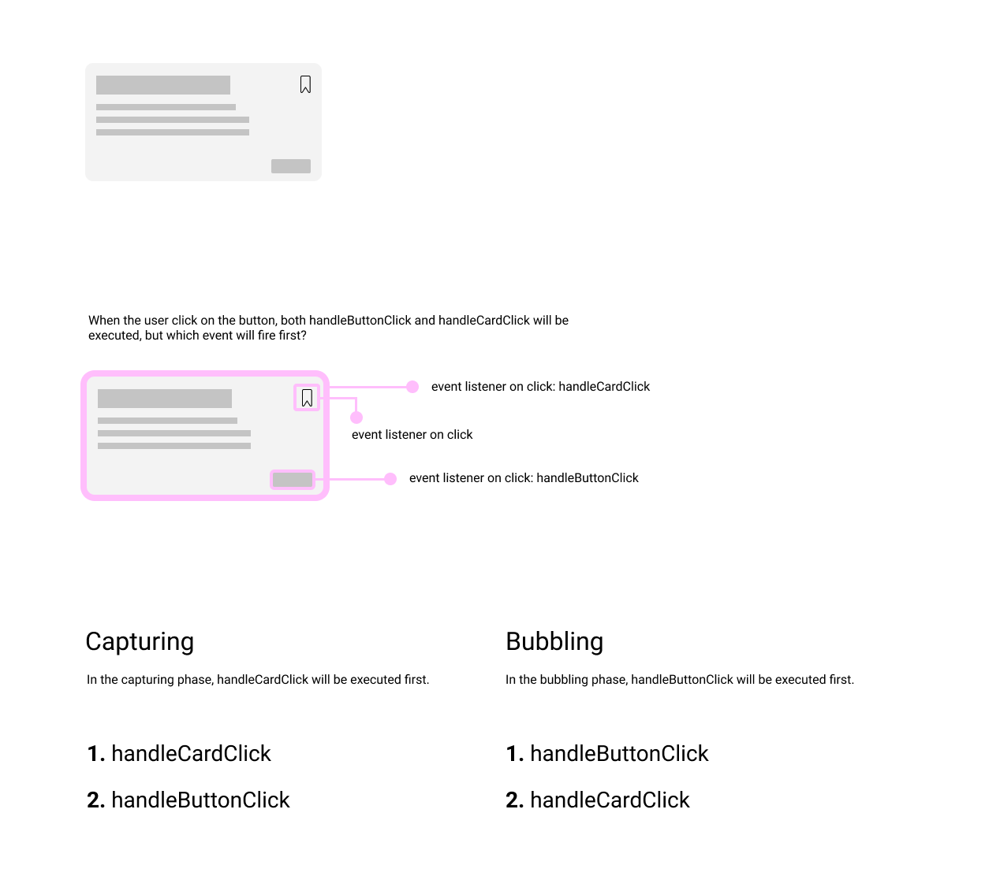
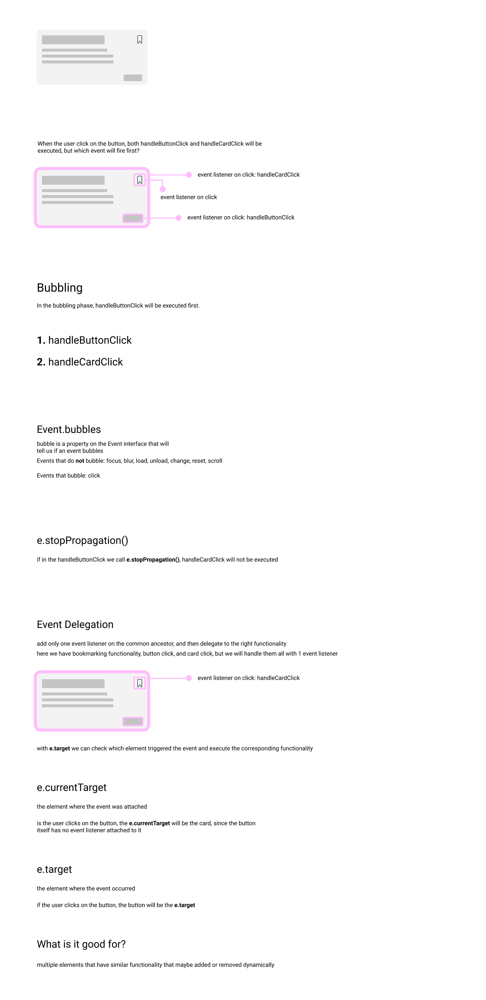

# Events 

```js
const element = document.querySelector('h1'); // return an element
```

`addEventListener` is a method that exists on the element.

So if you have a collection: 

```js
const elements = document.querySelectorAll('h1'); // return array-like collection of elements
```

the following will **throw an error**:

```js
elements.addEventListener('', function() {

});
```

The `addEventListener` method takes two params: the type of event, and a callback.
The type of the event can be one of a predefined set of available event types, like `click`, `mouseout`, `mousein`, `mousemove`, `scroll` etc.

The callback function is what will be excuted when the event happens.

```js
element.addEventListener('click', function() {
    console.log('the element was clicked');
});
```

The callback function takes one param: the `event`.

`event.preventDefault()` -> stop the default behavior of an element, like forms, or anchor links

## Event bubling and capturing



