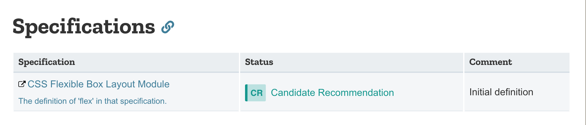
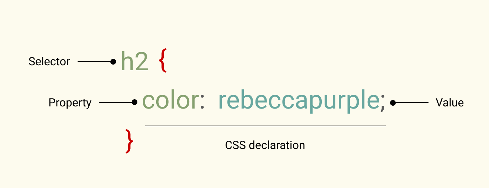
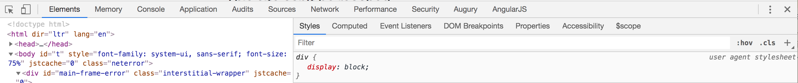

# CSS (Cascading Style Sheets)

## History

Back in the late 90s, Håkon Wium Lie noticed the need
for styling the HTML documents. Soon he was joined by Bert Bos
and together they developed an initial proposal.

The initial CSS proposal was presented at the Web conference in Chicago in November 1994.

CSS was not the only proposal at the time, but compared to the rest, it offered a novel take on things:
the style of a document couldn't be designed by either the author or the reader on their own, but that their wishes had to be combined.

Today, CSS has a dedicated Working Group within the World Wide Web Consortium (W3C) defining the new features of the language.
This means CSS is a living standard, that is subject to evolution and change.
Some features are being deprecated (their use will be no longer possible) while new ones are being added.

Whenever you wonder if you can use a certain CSS feature, you can check either on the [Can I use](https://caniuse.com/) website or within the MDN documentation, at the bottom of each reference page will be a list of supported browsers but also note on the current state of the feature in a section usually called Specifications.

[Read more](https://www.w3.org/Style/CSS20/history.html)

# CSS anatomy

# How to include CSS in your HTML document

* inline -> hard to read, hard to maintain, hard to reuse, hard to overwrite, have highest specificity
* in HTML -> similar issues like inline: hard to maintain, hard to reuse
* separate file -> easy to maintain and reuse

# C for Cascade

To put it simply, the cascade means that the order of the rules matters.
When two rules are targeting the same selector, the one that is last is the one applied.

This is only true though if both of these rules have the same specificity (see next section).

Essentially we overwrite the previously defined rules.

For this reason, it is important to start from the most generic rules, so it is easier to overwrite further down in the stylesheet document.

# CSS specificity

Specificity is a set of rules that determines how specific is a selector.

The higher the specificity, the harder it is to overwrite it with the use of the CSS cascade or with another CSS rule.

0 - 0 - 0 - 0

id - class - attribute - element

# Browser defaults

Even when there is no stylesheet applied to a HTML document,
there is some styling applied.
These defaults are needed for the document to be readable and visually structured.

HTML elements have some default styles that come from the browser.

You can see the default styles when you inspect an element in the dev tools.
In Chrome they are indicated as `user agent stylesheet`.

These default styles look quite similar, but they actually differ from browser to browser (take under consideration also the version of the browser).
This makes it harder to control and change.

To alleviate this issue, we often reset need to reset these defaults.

You could include a reset of your own (that is set of CSS rules that you have written).

Or alternatively, you can use already existing solutions:

* [Reset.css](https://meyerweb.com/eric/tools/css/reset/)
* [Normalize.css](https://necolas.github.io/normalize.css/)

Reset.css is reseting all default styles, so once applied to the HTML document,
we will no longer be able to tell the difference between a headline and a paragraph!

Normalize.css takes another approach and instead it is trying to normalize (hence the name)
the differences between different browsers.

Feel free to read the source code of either of those libraries,
it is just a bunch of CSS rules.
