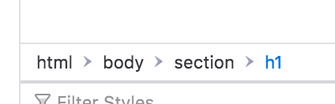
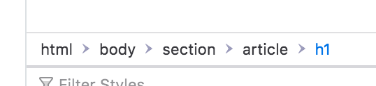
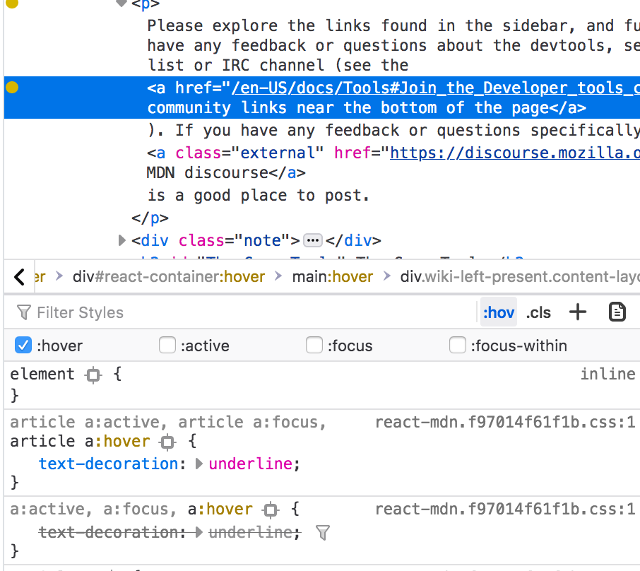
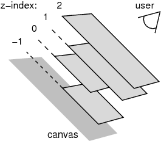

# CSS (Cascading Style Sheets)


## History

Back in the late 90s, Håkon Wium Lie noticed the need
for styling the HTML documents. Soon he was joined by Bert Bos
and together they developed an initial proposal.

The initial CSS proposal was presented at the Web conference in Chicago in November 1994.

CSS was not the only proposal at the time, but compared to the rest, it offered a novel take on things:
the style of a document couldn't be designed by either the author or the reader on their own, but that their wishes had to be combined.

Today, CSS has a dedicated Working Group within the World Wide Web Consortium (W3C) defining the new features of the language.
This means CSS is a living standard, that is subject to evolution and change.
Some features are being deprecated (their use will be no longer possible) while new ones are being added.

Whenever you wonder if you can use a certain CSS feature, you can check either on the [Can I use](https://caniuse.com/) website or within the MDN documentation, at the bottom of each reference page will be a list of supported browsers but also note on the current state of the feature in a section usually called Specifications.


[Read more](https://www.w3.org/Style/CSS20/history.html)

# CSS anatomy


# How to include CSS in your HTML document

* inline -> hard to read, hard to maintain, hard to reuse, hard to overwrite, have highest specificity
* in HTML -> similar issues like inline: hard to maintain, hard to reuse
* separate file -> easy to maintain and reuse

# C for Cascade

To put it simply, the cascade means that the order of the rules matters.
When two rules are targeting the same selector, the one that is last is the one applied.

This is only true though if both of these rules have the same specificity (see next section).

Essentially we overwrite the previously defined rules.

For this reason, it is important to start from the most generic rules, so it is easier to overwrite further down in the stylesheet document.

# CSS specificity

Specificity is a set of rules that determines how specific is a selector.

The higher the specificity, the harder it is to overwrite it with the use of the CSS cascade or with another CSS rule.

0 - 0 - 0 - 0

id - class - attribute - element

# Browser defaults

Even when there is no stylesheet applied to a HTML document,
there is some styling applied.
These defaults are needed for the document to be readable and visually structured.

HTML elements have some default styles that come from the browser.

You can see the default styles when you inspect an element in the dev tools.
In Chrome they are indicated as `user agent stylesheet`.


These default styles look quite similar, but they actually differ from browser to browser (take under consideration also the version of the browser).
This makes it harder to control and change.

To alleviate this issue, we often reset need to reset these defaults.

You could include a reset of your own (that is set of CSS rules that you have written).

Or alternatively, you can use already existing solutions:

* [Reset.css](https://meyerweb.com/eric/tools/css/reset/)
* [Normalize.css](https://necolas.github.io/normalize.css/)

Reset.css is reseting all default styles, so once applied to the HTML document,
we will no longer be able to tell the difference between a headline and a paragraph!

Normalize.css takes another approach and instead it is trying to normalize (hence the name)
the differences between different browsers.

Feel free to read the source code of either of those libraries,
it is a bunch of CSS rules.

# CSS Selectors

Selectors help us target HTML elements to apply styles to them. 
They are:

* are case-sensitive
* can contain only the characters [a-zA-Z0-9] and ISO 10646 characters U+00A0 and higher, plus the hyphen (`-`) and the underscore (`_`)
* **cannot** start with a digit, two hyphens, or a hyphen followed by a digit, that is to say they start with letters

[Read more in the specs](https://www.w3.org/TR/CSS22/syndata.html#characters)

## Universal selector `*`

The universal selector selector select all elements.

Its specificty is 0-0-0-0.

Use reponsibly, for example for resetting values or setting a reasonable default:

```css
* {
  box-sizing: border-box;
}
```

When you specify properties on the body, like so:

```css
body {
  font-family: sans-serif;
}
```

some of these properties will be inherited by its children elements.
On the contrary, when you use the `*` selector, each and every element will have this property applied to it.

## Type selector or HTML tag

Selects all elements that have the given element name. For example,

```css
a {
  text-decoration: none;
}
```

will select all anchor elements and remove the default underline.

## Id

You can select an element by its id attribute.

```html
<h1 id="article-on-geology-title">Article on geology</h1>
<h1 id="article-on-farming-title">Article on farming</h1>
```

```css
#article-on-geology-title {
  font-size: 42px;
  color: brown;
}
```

The id must exist in the html and it must be unique.
Targeting elements by their id attributed is performance-wise efficient 
but limits reusability.

## Classes

You can target HTML elements by their class attributes.
The values of class attributes dislike the values of id attributes, do not have to be unique.
For this reason, classes are great for creating reusable set of styles.
In addition, it is good to avoid unique names like `section-1` and `section-2` since this can limit significantly the reusability of CSS classes.

```html
<h1 class="article-title">Article on geology</h1>
<h1 class="article-title">Article on farming</h1>
```

```css
.article-title {
  font-size: 42px;
  color: black;
}
```

The class attribute accepts a space separated list of class names. One element can have many classes:

```html
<h1 class="article-title dark-theme">Article on geology</h1>
```

In CSS then you can target only the elements that have both classes, chaining them like so:

```css
.article-title.dark-theme {
  background-color: black;
  font-size: 42px;
  color: white;
}
```

Or you can make use of the cascade and overwrite some default styles when both classes are applied:

```css
.article-title {
  font-size: 42px;
  color: black;
}

.dark-theme {
  background-color: black;
  color: white;
}
```

In the example above, all elements with the class `article-title`
will have size of 42px and black text color.
The ones that have both classes,
will instead have a background color and a white text color.
`.dark-theme` comes later in the stylesheet (cascade) 
and has same specificity (0-0-1-0) 
so it overwrites the previously defined properties.

## Attribute selectors

Besides targeting elements by their id and class attributes,
one can target elements by other attributes.

```css
[attribute-name] {
  /* css properties go here */
}
```

When only the name of the attribute is specified
all elements that have such attribute will be selected,
regardless of its value.

For example, given this HTML:

```html


```

The following css will select all three elements:

```css
[alt] {
  border: 1px solid red;
}
```

To target all elements that have an empty `alt` attribute, we need to specify an attribute value, in this case just an empty string:

```css
[alt=""] {
  border: 1px solid red;
}
```

Note that the above example selectors will target all **elements** that have this attribute.
If we want to make sure we are targeting only images that have an empty alt attribute, we need to add the name of the tag to the selector: 

```css
img[alt=""] {
  border: 1px solid red;
}
```

To select the third element, we could write something like that:

```css
[alt="Some image description"] {
  border: 1px solid red;
}
```

This will select only the third element (given the above HTML), but it is a very specific selector and thus not reusable.

There are ways to match values without being overly specific.

For example to select all external links on a page:

```html
<a href="https://https://duckduckgo.com/">Duck Duck Go</a>
<a href="/internal-page.html">Link to some internal page</a>
```

```css
a[href^="href"] {
  background-color: mistyrose;
}
```

`^=` checks if the specified value is present at the beginning of the attribute value.
In this example, only the first link will get the mistyrose bacground color.

[Learn more on attribute selectors](https://developer.mozilla.org/en-US/docs/Web/CSS/Attribute_selectors)

# Selector combinators

It is possible to combine selectors in a way that gives them a useful relationship to each other and the location of content in the document.

## Descendant selector

The descendant selector enables you to select all children of a parent selector. In CSS you can achieve this by adding the parent selector, then the child selector separated by a space: `.page .page-title`.
The space is important! Without it the selecots becomes `.page.page-title` and it will be targeting all elements that have both `.page` and `.page-title` classes applied to them.

Given this HTML:

```html
<ul class="items-list">
  <li>
    Item A
  </li>
  <li>
    Item B
    <ul>
      <li>Item Bb</li>
    </ul>
  </li>
  <li>
    Item C
  </li>
</ul>
```

The following css will select all list items, even the ones that are nested in another `ul`:

```css
.items-list li {
  color: blue;
}
```

Using the descendant combinator can be very helpful when working on a certain area (a UI component) and you don't want to affect all elements of the same type.

For example, if you are working on a headline and you want to highlight one specific word within it:

```html
<h1 class="title">The quick brown fox <span class="highlight>jumps</span> over the lazy dog</h1>
```

You can write the following CSS to target the `span` element that is a child of the element with class `.title`:

```css
.title .highligh {
  background-color: white;
  font-weight: 300;
}
```

We can keep chaining descendant selectors. For example, to target the anchor tags 
that are children of list items, that are children
of a list element, we can write something like this:

```css
ul li a {
  text-decoration: none;
  border-bottom: 1px solid blue;
}
```

The specificity of this selector will be 0-0-3-0.
When reaching out to use a more specific CSS selector, always check if it is really needed. 
If you can achieve the same effect without being that specific with the selector, 
then go ahead and simplify the selector.

## Direct descendant combinator

We can be even more specific and select only the direct children of an element.

To do this, we use the greater-than symbol (>) to separate the parent from the child selector: 

```html
<section>
    <h1>Page title</h1>

    <article>
        <h1>Article title</h1>
    </article>
</section>
```

```css
section > h1 {
  font-size: 61px;
}
```

In this case, only the first `h1` will be selected as it is a direct child of the section element.

In the dev tools, you can see that the first `h1` has no other elements between itself and the `section` so it is a direct descendant:



The second `h1` has an `article` element between itself and the `section`, so it is not a direct descendant:



## Pseudo Classes

You can think of pseudo classes as descriptors to the element you are trying to select. The describe an element state or certain condition.
For example `a:hover` would select all anchor tag elements that are in the hover state.
Few example:

`:hover` -> mouse is over the element
`:active` -> the user is pressing on the element
`:focus` -> the element is focused (for example via keyboard navigation)

You can make use of the dev tools to to put elements in certain state while developing or debugging:



You need to select an element in the HTML, then toggle the `:hov` menu panel and select the state you want to apply.

Pseudo classes, also help target elements by their location in the document.
To name few examples: `:first-child`, `last-child`, `:nth-child()`, `:nth-of-type()`.

```html
<ul>
  <li>
    Item A
  <li>
  <li>
    Item B
  <li>
  <li>
    Item C
  <li>
</ul>
```

We want all list items to be separated with a border. We also want to remove the border from the last item, since there is no other `li` to separate it from:

```css
li {
  border-bottom: 1px solid gray;
}

li:last-child {
  border-bottom: none;
}
```

`nth-child()` and `nth-of-type()` can receive a number, a keyword or a formula.

For example to select every other element, we can write something like this:

```css
li:nth-child(odd) {
  background-color: lightgray;
}
```

[Learn more about `nth-child()`](https://developer.mozilla.org/en-US/docs/Web/CSS/:nth-child)

[Learn more about `nth-of-type()`](https://developer.mozilla.org/en-US/docs/Web/CSS/:nth-of-type)


The `:not()` pseudo class (also known as the negation pseudo-class) allows us to specify which elements to exclude from being selected.

```css
h1:not(.page-title) {
  font-size: 32px;
}
```

The `:not()` pseudo class takes a list of comma separated valid selectors as its argument.

Class selectors and pseudo class selectors have the same specificity weight.

The `:not()` pseudo class does not add to the speicificty count, but its parameters do.

For example `a:not(.external-link) {}` will have a specificity of 0-0-1-1.

# Pseudo elements

Pseudo elements allow us to select a part of an element.
For exampe `::first-letter` will select the first letter of a paragraph for example:

```css
p::first-letter {
  font-size: 42px;
}
```
One of the most used pseudo elements are `::before` and `::after`. 

Pseudo elements have the specificity of an element selector.

## Resources

* [CSS Selectors Game](https://flukeout.github.io/)

# Color in CSS

## named colors (red, blue, orange)
## hex
## rgb(a) - Red, Green, Blue and an optional Alpha value
## hls (Hue, Lightness, Saturation)
Hue: What color is it?
Lightness: How bright is it?
Saturation: How colorful is it?

## Resources

* [A Nerd’s Guide to Color on the Web](https://css-tricks.com/nerds-guide-color-web/)

# Position

Default position is `static`.
When position is `static`, the offset properties (`top`, `left`, `bottom`, `right`) and the `z-index` take no effect.

We say an element is positioned, when it has `position` with any the following values:

* **relative**:

  Once a box has been laid out according to the normal flow or floated, it may be offset relative to this position. This is called relative positioning.
* **absolute**: 
  
  In the absolute positioning model, a box is explicitly offset with respect to its containing block (that is a parent HTML element that is positioned). Absolutely positioned elements are removed from the normal flow entirely and so space is reserved for them. If an element contains only one absolutely positioned element, the containing element will have a height of 0, since the absolutely positioned child will be taking no space.
* **fixed**:
  
  Fixed positioning is similar to absolute positioning, they are removed from the normal document flow and no space is reserved. The only difference is that for a fixed positioned box, the containing block is established by the viewport. 
* **sticky**:
  
  A stickily positioned box is positioned similarly to a relatively positioned box, but the offset is computed with reference to the nearest ancestor with a scrolling box, or the viewport if no ancestor has a scrolling box.

# z-index

`z-index` orders an element according to an invisible stacking order.
Each positioned element creates a new stacking order.
The higher the `z-index` the higher an element is in the stacking order, that
is to say it appears on top of other elements (but only witin its stacking order).



# Overflow

Generally, the content of a block box is confined to the content edges of the box. In certain cases, a box may overflow, meaning its content lies partly or entirely outside of the box, to name few:

* A line cannot be broken, causing the line box to be wider than the block box.
* A block-level box is too wide for the containing block. 
* An element's height exceeds an explicit height assigned to the containing block 

# Flexbox

## Resources:

* [Flexbox Froggy](https://flexboxfroggy.com/)
* [The Difference Between Width and Flex Basis](https://gedd.ski/post/the-difference-between-width-and-flex-basis/)

# CSS Grid Layout (aka "Grid")

Grid Layout gives us a method of creating grid structures that are described in CSS and not in HTML. It helps us to create layouts that can be redefined using Media Queries and adapt to different contexts.

Unlike with an HTML table-based layout, you can layer items on the grid. So one item can overlap another if required.

Grid Layout finally gives us the ability to define grids in CSS and place items into grid cells. This on its own is great, but the fact that we don't have to specify each track and we don't have to place every item manually makes the new module even better. Grids are flexible enough to adapt to their items.

## Flexbox or grid?

[Email from Tab Atkins Jr.:](http://lists.w3.org/Archives/Public/www-style/2013May/0114.html)

Flexbox is for one-dimensional layouts - anything that needs to be laid out in a straight line (or in a broken line, which would be a single straight line if they were joined back together). Grid is for two-dimensional layouts. It can be used as a low-powered flexbox substitute (we’re trying to make sure that a single-column/row grid acts very similar to a flexbox), but that’s not using its full power.

## Grid terminology

**Grid Lines** are the lines that make up the grid. These can be horizontal or vertical. We can refer to them by number, or by name.

A **Grid Track** is the space between two Grid Lines, either horizontal or vertical.

A **Grid Cell** is the space between 4 Grid Lines. So it is the smallest unit on our grid that is available for us to place an item into. Conceptually it is just like a table cell.

A **Grid Area** is any area on the Grid bound by four grid lines. It may contain a number of Grid Cells.

2 axes:
* block (column) axis 
* inline (row) axis

> Note: float, display: inline-block, display: table-cell, vertical-align and column-* properties have no effect on a grid item.

## Usage

### Using `fr` with grid

The free space is calculated after any non-flexible items. In this example the total amount of free space available to the `fr` units doesn't include the 50px:

```css
.container {
  grid-template-columns: 1fr 50px 1fr 1fr;
}
```

### Gaps

`grid-column-gap`, `grid-row-gap`: The gutters are only created between the columns/rows, not on the outer edges.

Default value is `normal` (no space between items).

`grid-gap`: 

```css
.container {
  grid-gap: <grid-row-gap> <grid-column-gap>;
}
```

If no `grid-row-gap` is specified, it's set to the same value as `grid-column-gap`.

### Aligning items

`justify-items`: position horizontall in the cell
`align-items`: position vertically in the cell

## Aligning all the grid contents

`justify-content`: positions horizontally within the grid container
`align-content`: positions vertically within the grid container

## Implicit grid

Implicit tracks get created when there are more grid items than cells in the grid or when a grid item is placed outside of the explicit grid.

Specifies the size of any auto-generated grid tracks (aka implicit grid tracks):

* `grid-auto-columns`
* `grid-auto-rows`

If there are more grid items than cells in the grid or when a grid item is placed outside of the explicit grid, the grid container automatically generates grid tracks by adding grid lines to the grid. The explicit grid together with these additional implicit tracks and lines forms the so called implicit grid.

## Broswer support

Chrome, Firefox and Safari shipped grid support in March 2017. Edge shipped support in October 2017. IE10, 11 and Edge 15 and lower support an older, prefixed spec.

## Resources

* [Grid Garden](https://cssgridgarden.com/)
* [Learn CSS Grid - A Guide to Learning CSS Grid](https://learncssgrid.com/)
* [CSS Grid — Learn all about CSS Grid with Wes Bos](https://cssgrid.io/)
* [Grid by example](https://gridbyexample.com)

# Resources

* [When does white space matter in HTML?](https://patrickbrosset.com/articles/2016-10-21-when-does-white-space-matter-in-HTML.html)
