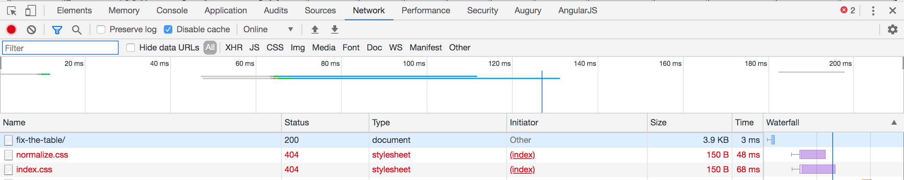
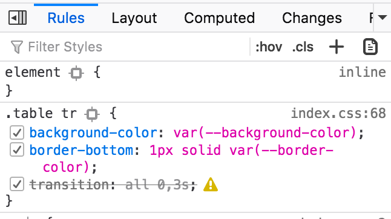
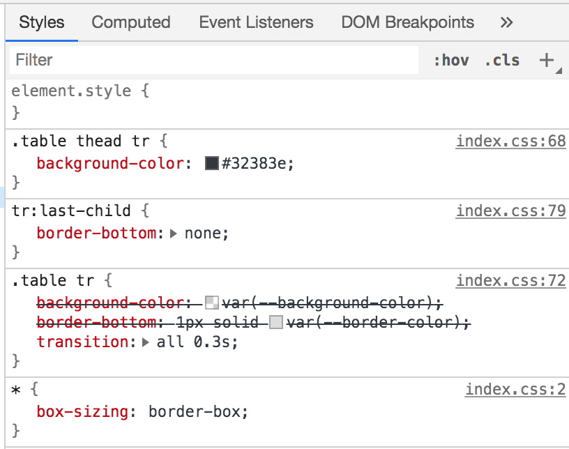
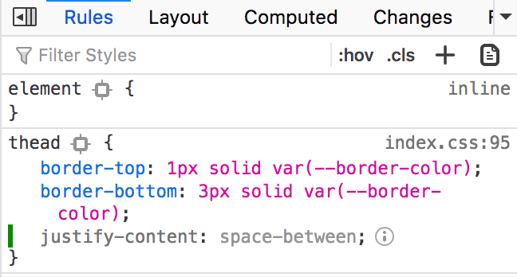
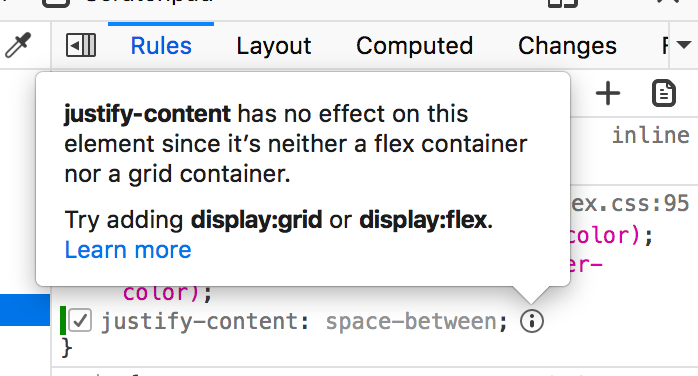

# Debugging HTML and CSS

If you keep adding styles, but you do not see the expected results in the browser, you can do couple of things to debug the situation.

1. open the dev tools
2. find the element you just applied styles to
3. take a look in the styles in the styles pane

## Styles do no appear in the styles pane at all

To debug, open the Network tab (you might need to refresh the page). Check if any of your styles files is not loaded successfully (status code must be 200 to be successfully loaded).

In this example 2 css files were not loaded, their status is 404. Hover over the file name to see the file path where the browser is using to retrieve them from - it is possible you have the wrong file path.

If the files are not listed at all in the Network pane - probably the files were not linked in the HTML `<head>`.

## Styles appear in styles pane

Great, styles appear, but they are still not applied. You can check if your styles rules appear crossed over. This could mean the rules are either invalid or being overridden by some other styles.

Invalid styles will be indicated with a warning icon besides them in both Chrome and Firefox:

In the following example the rule on line 68 is overwriting the rule from line 72 - an example of CSS specificity.

If you are using Firefox, you can get a visual hint whenever the rules are not applicable. For example using flex related properties without setting `display: flex`:

## Resources

> Check out this very helpful [entry on MDN](https://developer.mozilla.org/en-US/docs/Learn/CSS/Building_blocks/Debugging_CSS) to read more on debugging HTML and CSS.