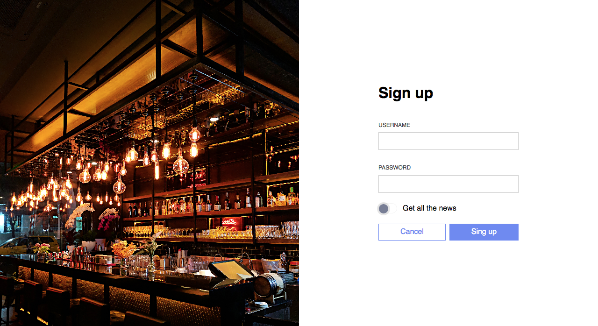

# Login page

Let's create a login page!

* two input fields
* two buttons (one submits the form, one clears it)
* clicking on the label focuses its field

* there is a toggle -> what type of input can you use for it?

Extra:

* buttons and fields are aligned
* add hover effect on the buttons
