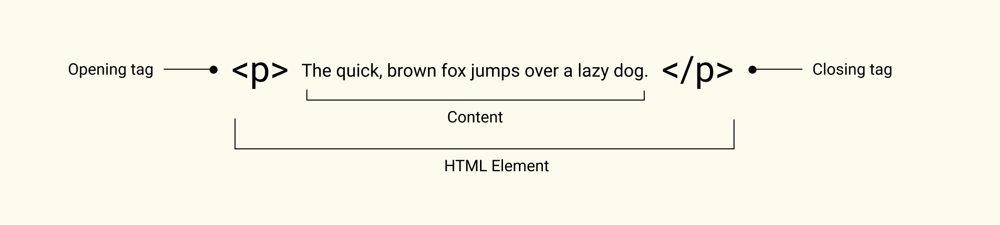

# HTML (Hypertext Markup Language)

## History

In the late 90s Tim Berners Lee wrote the initial HTML specification.

## What is a markup language?

A markup language annotates text with text.
It is important that we can easily tell the annotations apart from the rest of the text.

For example, HTML uses text wrapped in `<` and `>` brackets to describe the structure of our content.

Even though HTML is only providing structure, when one opens an HTML page
that has no styling applied to it,
HTML elements like headlines for example will appear visually different than paragraphs.

This is the default styling from the browser, so the document
appears visibly structured and is more readable.

If there was no default styling, we would not be able to tell the difference
between a headline and paragraph unless we look into the code
instead of the rendered version in the browser.

# Anatomy of an HTML element



The HTML element in the example above has an opening tag, closing tag
and some content, which in this case is text.

## Nesting elements

In the example above the content of the `<p>` is text.

Besides text, the content of an HTML element can be another HTML element.

When we put an HTML element inside another HTML element, we say we are nesting an element.
The `<span>` is nested inside the `<p>`:

```html
<p>The quick, <span>brown fox jumps</span> over a lazy dog.</p>
```

## Self closing elements

Some HTML elements don't need closing tags,
for example `` or `<input />`: they are called `self closing elements`.

## Attributes

HTML elements can have attributes. Attributes configure elements or adjust their behavior.

```html
    <a href="http://duckduckgo.com" target="_blank">A Very Useful Link</p>
/**     ↑                              ↑
 * Attributes like href           and target */
```

Attributes have default values. You need to set the value
only if the new value is different than the default.

```html
    <a href="#bookmark-1" target="_self" />
```

The `target` attribute has a default value of `_self`, so can omit it from the example above.

Note, the `id` attribute requires its value to be unique for the entire document.

Usually, attributes have values (after the equal sign). But they don't have to!
For example, `disabled` is also an attribute that can be used with `input` elements.

```html
    <input type="text" disabled />
```

The `disabled` attribute indicates that the user cannot interact with the input field.
Essentially its value is `true`. It is the same as:

```html
    <input type="text" disabled="true" />
```

In many cases attributes are optional. For example, both `id` and `class` are attributes
that can be optionally added to an HTML element.

Some attributes though are needed for the element to work as expected.

```html
    
```

For example, if the `img` element is missing its `src` attribute,
no image will be rendered.

### Custom attributes

Some attributes come out of the box, they are built in like `class`, `href` and so on.

But developers can also add their own HTML attributes, called **custom data attributes**.

You need to prefix the attribute name with `data-*`.

The name cannot contain semicolon (`;`) or capital letters.

```html
<p data-item="345678">The quick, brown fox jumps over a lazy dog.</p>
```

The name of the custom data attribute in this example is `item` and the value is `345678`.

These custom data attributes can be used to fill the CSS `content`
property with some custom content.

# HTML entities

Some characters have special meaning in HTML.
For example the `<` is used to indicate the beginning of an HTML
tag and the `>` - the end, like in `<p>`.

These special meaning characters are reserved.

If we want to use them as plain text instead of as the beginning or ending of a tag,
we need to make this explicit to the browser and we do this by 'escaping' the characters.

We do this with the help of HTML entities.

Each entity begins with an ampersand (`&`) and ends with a semicolon (`;`).

The HTML entity for the `<` is `&lt;` which stands for **l**ess **t**han.

Another use case for the HTML entities is to enter characters
that might be hard to type on standard keyboards.

We can transform reserved characters into HTML entities manually.
But this can easily get very tedious and tiring, not to mention error-prone.

Another way would be, to make use of online services like [this one](https://convertstring.com/EncodeDecode/HtmlEncode), for example.

If you are using Visual Code, you could install this very [handy extension:  html-entities](https://marketplace.visualstudio.com/items?itemName=christopherstyles.html-entities).

To find a list of the official entities check this [page](https://html.spec.whatwg.org/multipage/named-characters.html#named-character-references).

[Read more on MDN](https://developer.mozilla.org/en-US/docs/Glossary/Entity)

# Correct HTML

Whenever we forget to close an element properly,
or we use an attribute that does not exist,
we say our HTML is invalid.

It might be quite difficult to spot the issue,
as the browser will most probably still render something and no errors will be thrown.

What happens is that the browser tries to correct the mistake as good as it can.
Sometimes this can be enough, but sometimes we might end up with unexpected results.

Try this [online HTML validator](https://validator.w3.org/nu/#textarea).

* obsolete HTML tags

### White space in html

```html
<div>
  <p>Dogs are silly.</p>

  <p>Dogs        are
           silly.</p>
</div>
```

In the example above, the white spaces (in front of the opening `p` tags, but also inside the paragraph itself) will be ignored.

So why use so much whitespace?

The answer is readability — it is so much easier to understand what is going on in your code if you have it nicely formatted.

In our HTML we've got each nested element
indented by two spaces more than the one it is sitting inside.
It is up to you what style of formatting you use (how many spaces for each level of indentation, for example), but you should consider formatting it.
This will help you with reading more easily through your code, but also
will allow you to use code editor features like collapsing.

## Semantic HTML or why can't we use only divs or only sections?

Some HTML elements lack any meaning, so when looking at the tag,
you cannot tell what its contents might be.
For example, a `div` element can contain a site menu or a sidebar
and we have no way of guessing the contents based on the name of the element.

On the contrary, when using semantic HTML elements,
you can mark up sections of content based on their functionality.

A `<nav>` HTML element marks a section that provides navigation links.

HTML5 adds many semantic elements, to name few:
`<main>`, `<header>`, `<footer>`, `<aside>`, `<article>`.

* **Accessibility**: Screen readers can recognise semantic elements and help with tasks like "find the main navigation", or "find the main content."

* **Readability**: When naming things correctly, we lower our mental load of having to figure out their actual purpose.

* **SEO**: Semantic HTML elements can give additional meaning to the
crawlers. For example, `<h1>` indicates the most important piece of information on
the page or within a section.

# HTML elements

## Anchor tag

new tab, email, same page link,

### The `target` attribute

The target attribute specifes where the linked resource should open.
By default, it opens in the same page.

By convention, links to external sites should open in a new tab and
links leading the different pages or section
of the same site should open in the same tab.

### In page navigation (or scroll to section)

We can use anchor tags to create in page navigation.
In order to do this, we need to set the anchor `href` attribute
value to the `id` of an element that exists on the page.

```html
    <a href="#section-01">Section 01</a>
```

To be able to see the effect, we need to have a bigger amount of content
so the page becomes scrollable.

The anchor tag value will be appended to the URL.

For example, if we are running a local server, after clicking on the link from the example above,
the URL will become `http://localhost:8080#section-01`.

Besides using the `id` of the element,
the `href` attribute can receive some predefined values,
called fragments, like `#top`.
It specifies the top of the page and on click on the link the page will scroll to the top.

### Contacts

#### Phone link

```html
<a href="tel:+491570156">+49 157 0156</a>
```

#### Email link

```html
<a href="mailto:nowhere@example.org">Email me</a>
```

We can specify additional parameters, like subject for example.
To do this, we add a `?` after the email address, and
then list the parameters and their values separating the parameters with `&`.

```html
<a href="mailto:nowhere@example.org?subject=Enter here the subject of your email&body=Here goes the body of the email">
  Email me
</a>
```

Clicking on this link will open the default email client,
and will prefill the email recipient with the email specifed and
the subject line with the provided text.

### Download

The `download` attribute instructs the browser to download the linked resource
instead of navigating to it.

This attribute can be used without specifying a value.
If a value is specified, then it will be used as the suggested name
in Save window.

For certain file types, like `pdf` for example, browsers have built in previewers
that also have a button to download the file,
so there might be no need to add the `download` attribute.
